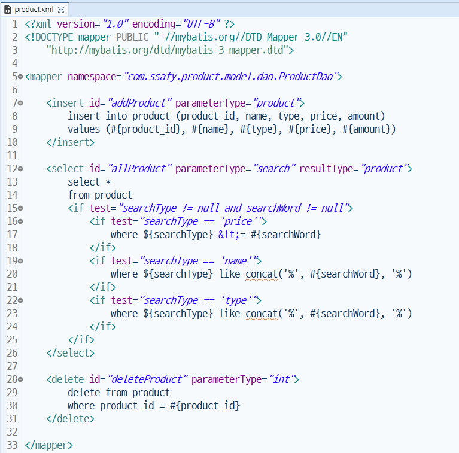
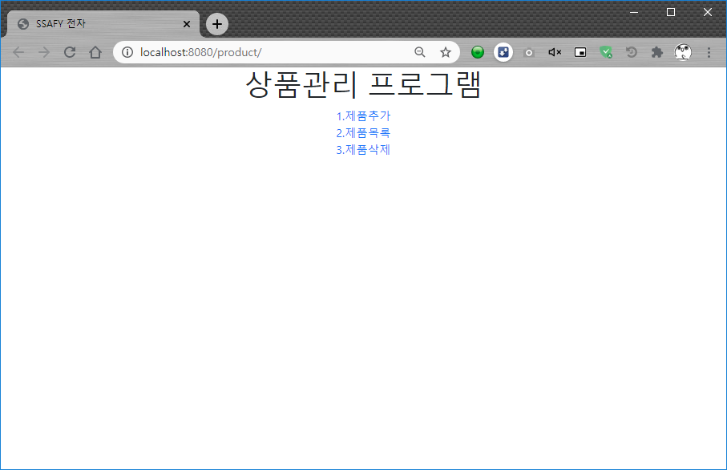
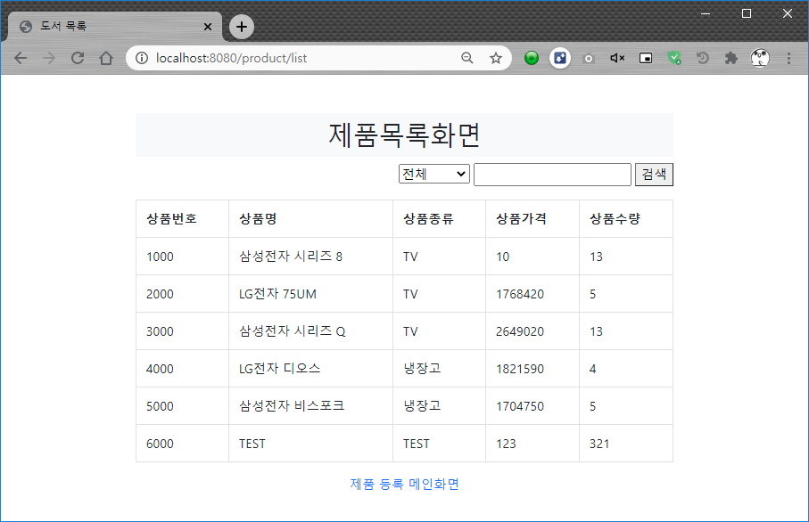
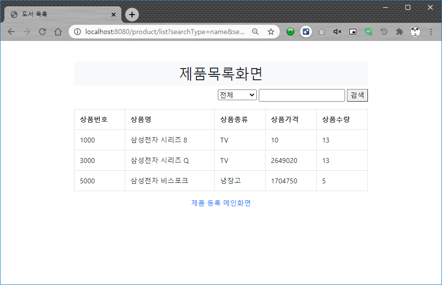
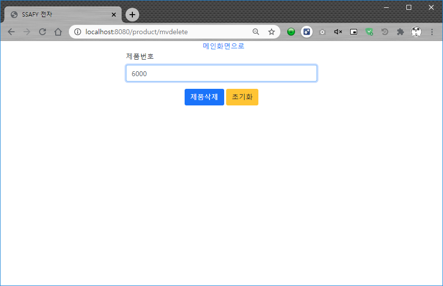
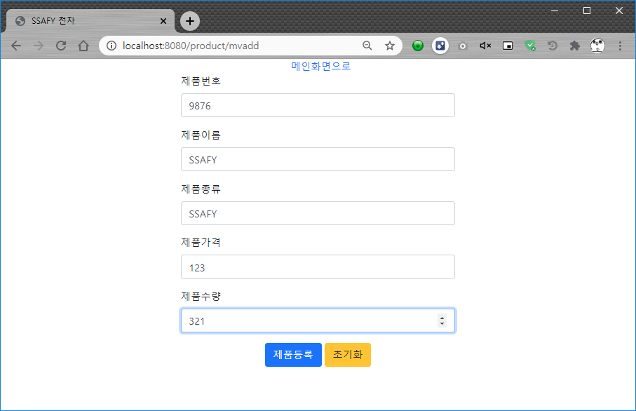
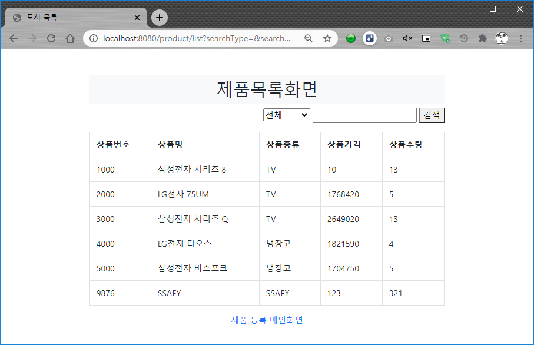

<h4>제품검색화면 Spring MVC & MyBatis 적용</h4> 

<h4>product.xml</h4> 
 

<h4>시작화면</h4> 
 

<h4>제품전체화면</h4> 
 

<h4>제품이름검색화면(삼성)</h4> 
 

<h4>제품삭제화면 및 리스트로 리다이렉트</h4> 

 

<h4>제품추가화면 및 리스트로 리다이렉트</h4> 

 

